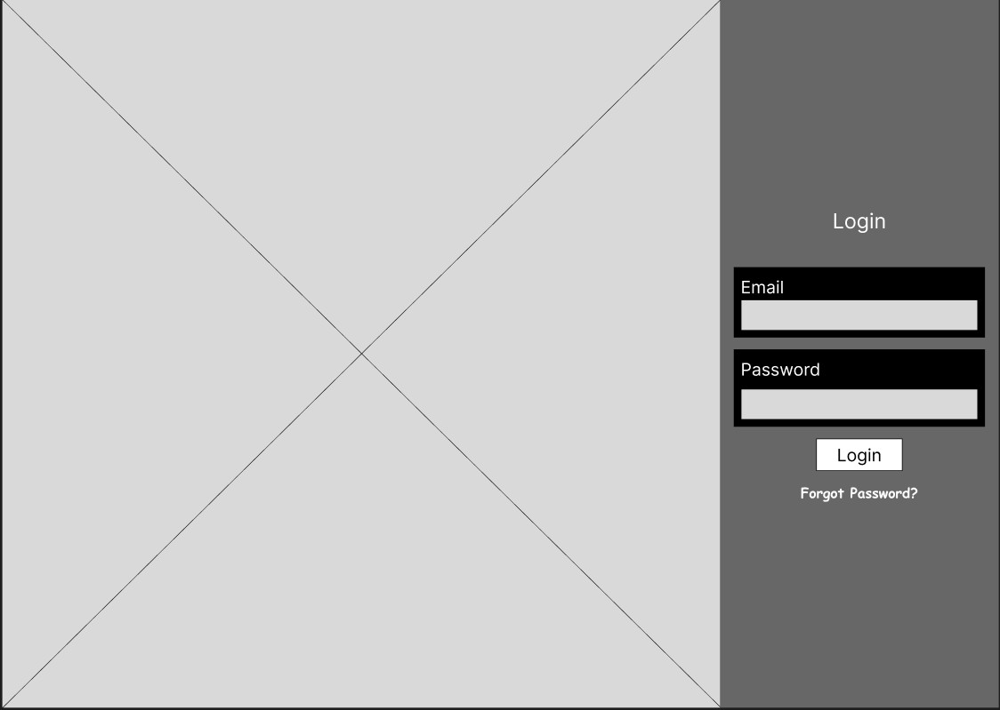
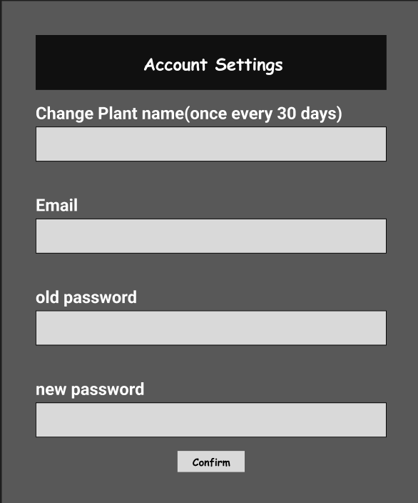
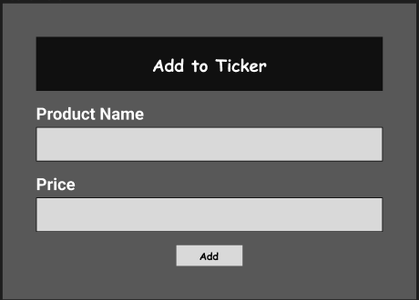
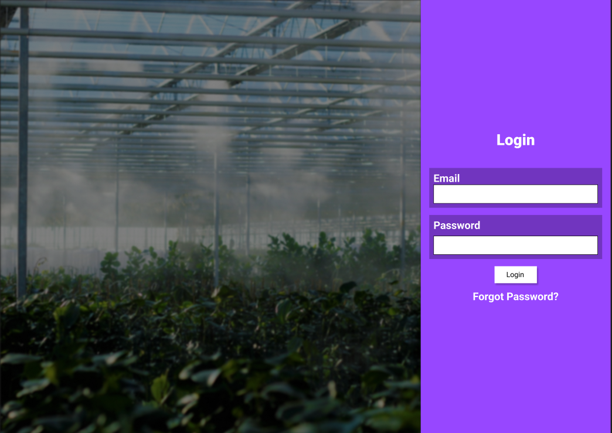
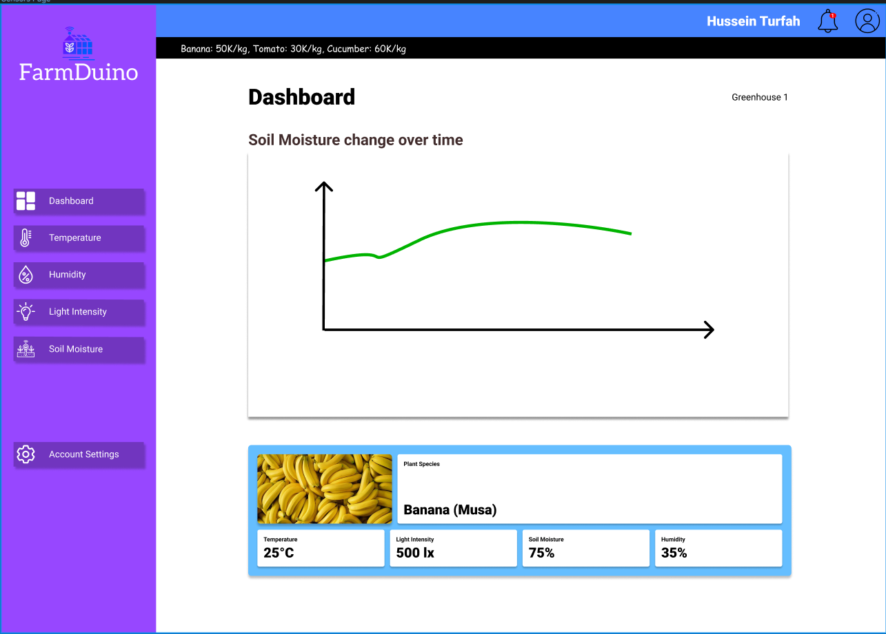
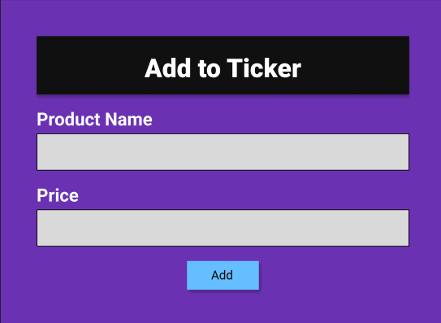

<br><br>

<!-- project philosophy -->


> FarmDuino is a desktop application designed to revolutionize greenhouse farming by providing an intuitive and efficient solution for controlling the farming environment.
> 
> Our goal is to empower greenhouse owners to easily manage and customize their greenhouse conditions, leading to improved crop yields and optimized farming processes.

### User Stories

- As a user, I want to monitor market prices for vegetables and fruits so that I can maximize profits.
- As a user, I want to log out of my account so that I can ensure the security of my account information.
- As a user, I want to change my email address so that I can update my contact information.
- As a user, I want to change my password so that I can enhance the security of my account.
- As a user, I want to reset my password so that I can regain access to my account if I forget it.
 
### Greenhouse Owner Stories

- As a greenhouse owner, I want to remotely monitor and customize actuators based on environmental factors so that I can optimize crop growth conditions.
- As a greenhouse owner, I want access to recommended environmental thresholds for my crops to configure the actuators and provide ideal conditions.
- As a greenhouse owner, I want to graphically visualize the historical data of environmental conditions, so that I can analyze trends and patterns in past occurrences.
- As a greenhouse owner, I want to check weather forecasts for my greenhouse location so that I can plan actuator schedules and adapt to upcoming weather conditions.
- As a greenhouse owner, I want to review past notifications so that I can stay informed about greenhouse incidents and changes during my absence.

### Admin Stories

- As an admin, I want to access a list of users and their planted crops so that I can conduct studies and researches.
- As an admin, I want to update the ticker with market prices of fruits and vegetables so that greenhouse owners can view them.

<br><br>

<!-- Prototyping -->


> We designed FarmDuino using wireframes and mockups, iterating on the design until we reached the ideal layout for easy navigation and a seamless user experience.

### Wireframes
| Login screen  | Register screen |  Landing screen | 
| ---| ---| ---|
|  |  |  | 

| Sensors screen | Account Settings Modal | Admin Main Screen |
| ---| ---| ---|
 |  |  |

| Insert to Ticker Modal | Admin Settings Modal |
| ---| ---|
|  |  |

### Mockups
| Login screen  | Register screen |  Landing screen | 
| ---| ---| ---|
|  |  |  | 

| Sensors screen | Account Settings Modal | Notifications Modal |
| ---| ---| ---|  
|  |  |  |  |

| Admin Main Screen | Insert to Ticker Modal | Admin Settings Modal |
| ---| ---| ---|
|  |  |  |

<br><br>

<!-- Implementation -->


> Using the wireframes and mockups as a guide, we implemented the FarmDuino app with the following features:

### User Screens (Desktop & Web)
| Login screen  | Register screen | Landing screen |  Landing Screen | 
| ---| ---|  ---| ---|
|  |  |  |  |

| Sensors screen | Sensors screen | Account Settings Modal | Notifications Modal | 
| ---| ---| ---| ---|
|  |  |  |  |


### Admin Screens (Desktop & Web)
|  Landing Screen | Settings Modal | Ticker Modal |
| ---| ---| ---|
|  |  |  |

<br><br>

<!-- Tech stack -->


###  FarmDuino is built using the following technologies:

- The project uses [Arduino](https://www.arduino.cc/), a microcontroller platform, to collect and process data from various sensors installed in the farm.
- The frontend of the application is built using [React JS](https://react.dev/), a popular JavaScript library for building user interfaces.
- [Electron JS](https://www.electronjs.org/) is used to develop a desktop application that can be installed and used on different operating systems.
- [Laravel](https://laravel.com/) is used to develop the backend of the application. Laravel is a PHP framework that allows us to build web applications quickly and efficiently.
- [Roboto](https://fonts.google.com/specimen/Roboto) font is used as the main font throughout the application.

<br><br>

<!-- How to run -->


> To set up FarmDuino locally, follow these steps:

### Prerequisites

Make sure you have the following installed on your computer:

   - Composer
   - npm (Node Package Manager)
   - PHP
   - MySQL
   - Node.js


### Installation

_Below is an example of how you can instruct your audience on installing and setting up your app. This template doesn't rely on any external dependencies or services._

1. Get a free API Key at [OPENAI](https://openai.com/blog/openai-api) and at [Open Weather Map](https://openweathermap.org/api)
2. Clone the repo
   ```sh
   git clone   https://github.com/Hussein-Turfah/FarmDuino.git
   ```
3. Install NPM packages inside the `desktop` folder
   ```sh
   npm install
   ```
4. Install Composer packages inside the `server` folder
   ```sh
   composer install
   ```
5. Migrate the database from inside the `server` folder 
   ```sh
   php artisan migrate
   ```
6. Enter your API in `.example.env` and rename it to `.env`
   ```js
   OPENAI_API_KEY = 'ENTER YOUR API'
   WEATHER_API_KEY='ENTER YOUR API'
   TREFLE_API_KEY = 'ENTER YOUR API';
   ```

Now, you should be able to run FarmDuino locally and explore its features 🤩.