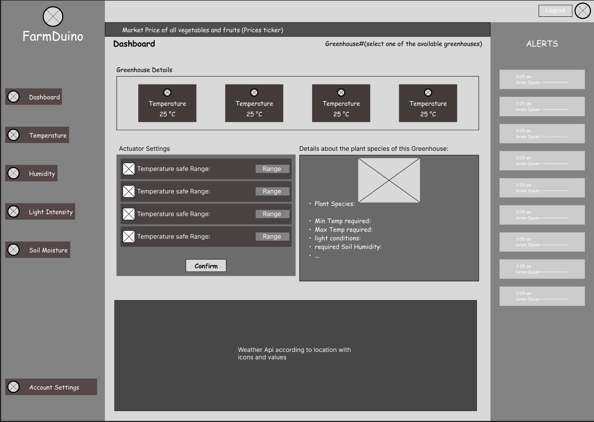
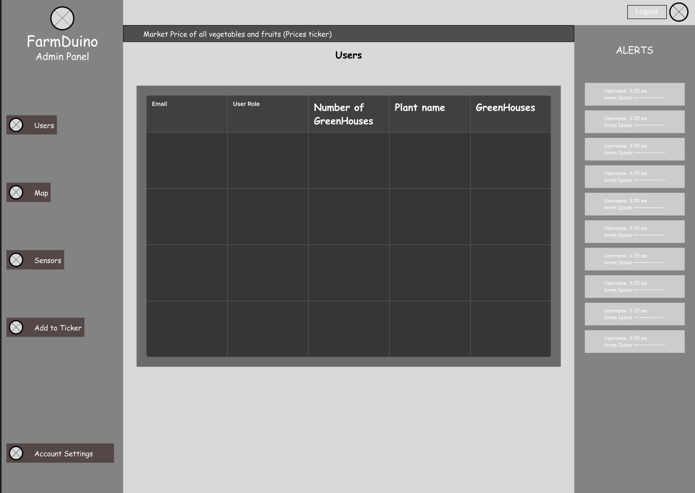
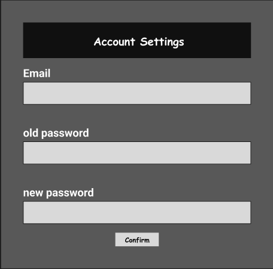
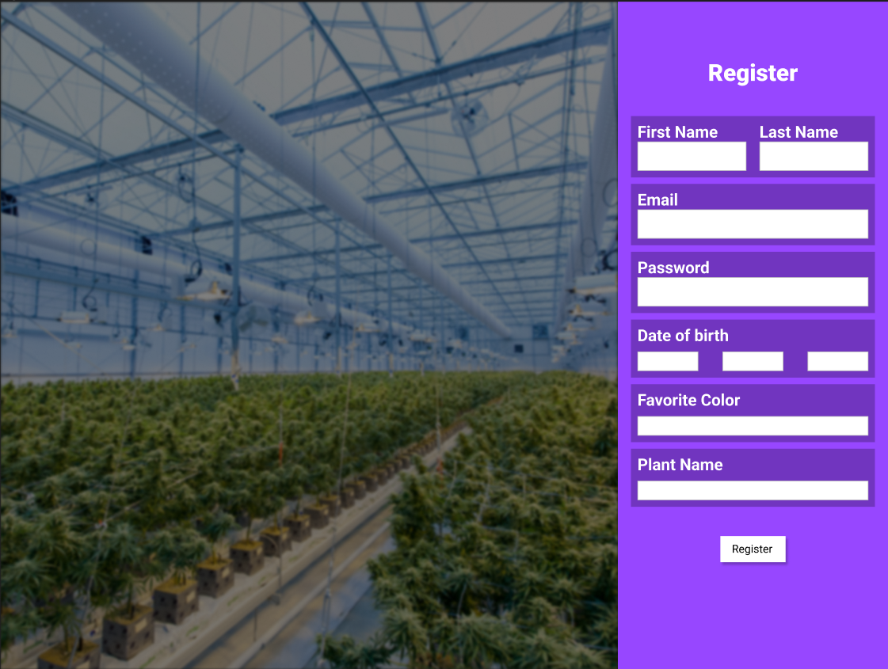
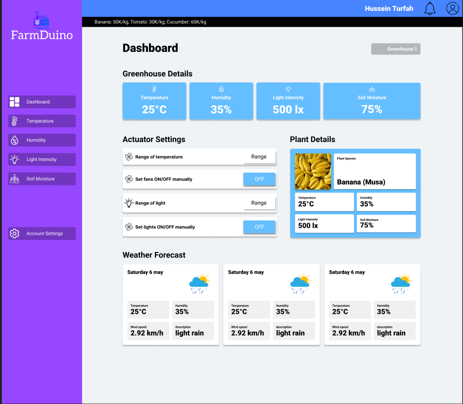
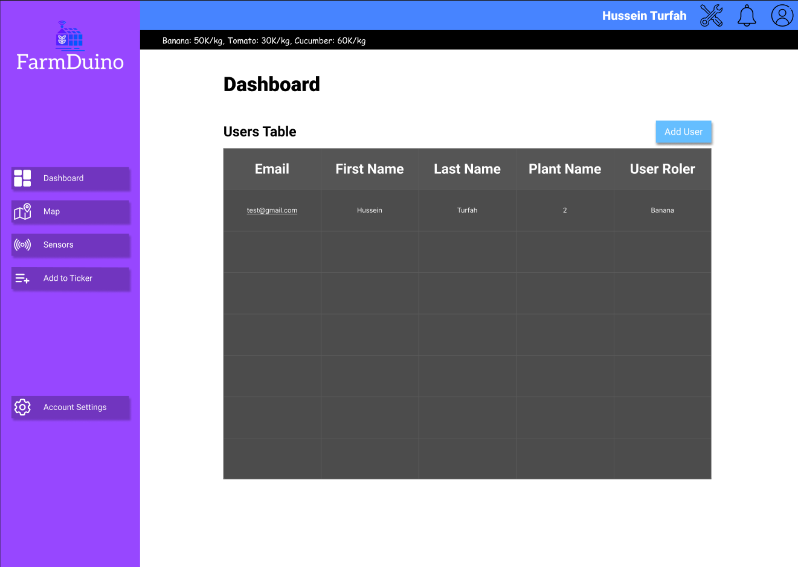

<br><br>

<!-- project philosophy -->


> A Desktop app for controlling farming environment, making it easier for greenhouse owners to change their greenhouse environment easily.
>
> FarmDuino is a smart farming solution that aims to streamline the agricultural process by providing a user-friendly platform for farmers to monitor and manage their crops. Our goal is to enhance the farming experience by saving time and improving crop yield.

### User Stories
- As a greenhouse owner, I want to register an account so that I can log my data under my email address.
- As a greenhouse owner, I want to login to my account so that I can control my greenhouses and view my data.
-	As a user, I want to be able to log out of my account so that I can ensure the security of my information and prevent unauthorized access.
- As a greenhouse owner, I want to be able to reset my password so that I’ll be able to access my account if I forgot the password.
- As a greenhouse owner, I want to be able to change my email address, so that I can update my contact information and receive important notifications on my new email address.
- As a greenhouse owner, I want to change my password, so that I can ensure the security of my account.
- As a greenhouse owner, I want to remotely monitor real-time temperature and humidity levels in my greenhouse, so that I can ensure the optimal growth conditions for my crops are being maintained.
- As a greenhouse owner, I want to remotely monitor soil moisture levels in my greenhouse, so that I can conserve water and reduce costs by watering my crops only when necessary.
- As a greenhouse owner, I want to monitor the light levels in my greenhouse so that I can ensure my crops are receiving the appropriate amount of light for optimal growth.
- As a greenhouse owner, I want to customize the triggering system of the actuators according to my crop’s needs in terms of temperature, humidity, light intensity, and soil moisture levels so that I can ensure optimal growth conditions for my crops.
- As a greenhouse owner, I want to receive real-time alerts when any sensor malfunctions, so that I can quickly identify and resolve any problems that arise.
- As a greenhouse owner, I want to remotely control devices in my greenhouse, such as turning on or off fans, heaters, or lights, so that I can ensure optimal growing conditions for my crops even when I am not on-site.
- As a greenhouse owner, I want to check previously triggered notifications so that I can know if anything happened during my rest hours.
- As a greenhouse owner, I want to check levels of temperature, humidity, light intensity, and soil moisture recommended for my crops so that I can make the actuators function accordingly. 
- As a greenhouse owner, I want to check the weather forecast on each greenhouse location so that I can plan for my actuator schedules ahead.
- As a greenhouse owner, I want to check the prices of different fruits and vegetables in the market so that I can know when I can get good selling prices.
- As an admin, I want to login to my account so that I can control the greenhouses and access my data.
- As an admin, I want to be able to change my email address, so that I can update my contact information.
- As an admin, I want to change my password, so that I can ensure the security of my account.
- As an admin, I want to view a list of the users along with their planted crops so that I can conduct studies on crops the Arduinos are being used for.
- As an admin, I want to check the prices of different fruits and vegetables in the market so that I can conduct studies of different purposes.
-	As an admin, I want to add market prices of different fruits and vegetables to a ticker so that I can show them to greenhouse owners.


<br><br>

<!-- Prototyping -->


> We designed FarmDuino using wireframes and mockups, iterating on the design until we reached the ideal layout for easy navigation and a seamless user experience.

### Wireframes
| Login screen  | Register screen |  Landing screen | 
| ---| ---| ---|
|  |  |  | 

| Sensors screen | Account Settings Modal | Admin Main Screen |
| ---| ---| ---|
 |  |  |

| Insert to Ticker Modal | Admin Settings Modal |
| ---| ---|
|  |  |

### Mockups
| Login screen  | Register screen |  Landing screen | Sensors screen | Account Settings Modal | Notifications Modal | Admin Main Screen | Insert to Ticker Modal | Admin Settings Modal |
| ---| ---| ---|
|  |  |  |  |  |  |  |  |  |

<br><br>

<!-- Implementation -->


> Using the wireframes and mockups as a guide, we implemented the Coffee Express app with the following features:

### User Screens (Mobile)
| Login screen  | Register screen | Landing screen | Sensors screen | Account Settings | 
| ---| ---| ---| ---|
|  |  |  |  |
| Home screen  | Menu Screen | Order Screen | Checkout Screen |
|  |  |  |  |

### Admin Screens (Web)
| Login screen  | Register screen |  Landing screen |
| ---| ---| ---|
|  |  |  |
| Home screen  | Menu Screen | Order Screen |
|  |  |  |

<br><br>

<!-- Tech stack -->


###  Coffee Express is built using the following technologies:

- This project uses the [Flutter app development framework](https://flutter.dev/). Flutter is a cross-platform hybrid app development platform which allows us to use a single codebase for apps on mobile, desktop, and the web.
- For persistent storage (database), the app uses the [Hive](https://hivedb.dev/) package which allows the app to create a custom storage schema and save it to a local database.
- To send local push notifications, the app uses the [flutter_local_notifications](https://pub.dev/packages/flutter_local_notifications) package which supports Android, iOS, and macOS.
  - 🚨 Currently, notifications aren't working on macOS. This is a known issue that we are working to resolve!
- The app uses the font ["Work Sans"](https://fonts.google.com/specimen/Work+Sans) as its main font, and the design of the app adheres to the material design guidelines.

<br><br>

<!-- How to run -->


> To set up Coffee Express locally, follow these steps:

### Prerequisites

This is an example of how to list things you need to use the software and how to install them.
* npm
  ```sh
  npm install npm@latest -g
  ```

### Installation

_Below is an example of how you can instruct your audience on installing and setting up your app. This template doesn't rely on any external dependencies or services._

1. Get a free API Key at [https://example.com](https://example.com)
2. Clone the repo
   ```sh
   git clone https://github.com/your_username_/Project-Name.git
   ```
3. Install NPM packages
   ```sh
   npm install
   ```
4. Enter your API in `config.js`
   ```js
   const API_KEY = 'ENTER YOUR API';
   ```

Now, you should be able to run Coffee Express locally and explore its features.